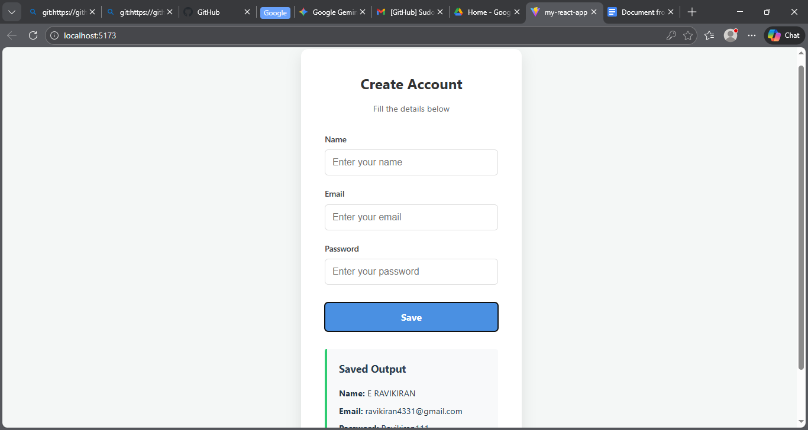

# 📝 Survey App

This repository contains a simple **Survey Application** built for practice and learning.  
The app allows users to **register, fill out forms, validate inputs, and submit details**.  
It was developed using a mix of frontend and backend technologies, focusing on form handling and data validation.

---

## 🚀 Features
- User registration and form submission
- Input validation before saving data
- JSON-based data handling
- Lightweight design with custom styles
- Built with Node.js for backend logic

---

## 🛠️ Tech Stack
- **Frontend:**  
  - `app.jsx` (React component logic)  
  - HTML (structure)  
  - CSS (`style.css`) for styling  
  - Notepad / VS Code for editing  

- **Backend:**  
  - **Node.js** for server-side functionality  
  - JSON files for storing and managing.
 
## 📸 Screenshots

Here are some previews of **MySurveyApp** in action:

### Interactive Form

### Registration Form

### Validation Form

